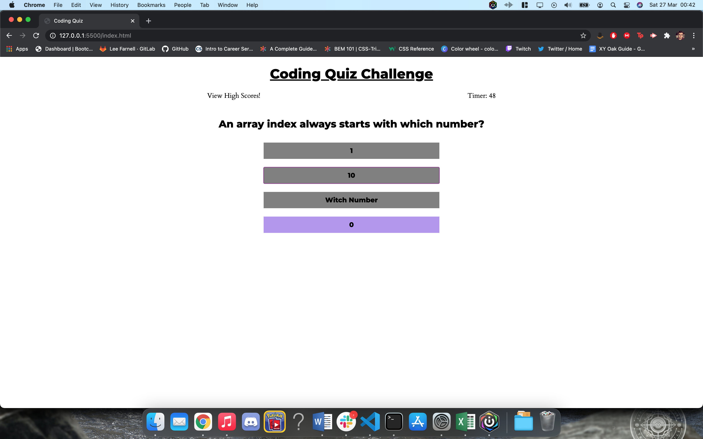

## Coding Quiz Challenge

Welcome to the Coding Quiz Challenge. As part of the Coding BootCamp, I was tasked with a user story to create a fully working quiz, based around coding, putting to use my skills with HTML, CSS and Javascript.

Building every element of the website from the ground up, I had to create a fully dynamic website to ensure all the necessary criteria from the user story was met.

Some of the challenges I was tasked with were:

- A working timer which counted down to 0. This timer also had to stop once the quiz was over and be used as a high score. If the timer reached 0, then the user is greeted with a Game Over screen. Timer also had to subtract time if a question is answered wrong.
- A series of quiz questions, the first of which appear once the start quiz button is pressed. Once the first question is answered, this had to disappear and the second set of questions be presented. We continue through this cycle until all the questions have been answered or the timer has run out.
- Make the user able to complete the quiz and submit their name and their score to the high scores page. The scores are then shown in order, with the highest score at the top.
- The user also had to able to clear their local storage of previous scores and remove them from the high scores page.

This project was a new challenge for me and one of the more difficult tasks we've faced. Whilst there are parts of this which will need work down the line (for example, the scores being presented with commas), overall, I am happy with how this turned out and that I met all the necessary criteria.

## Link to Deployed Application

https://leefarnell.github.io/Coding_Quiz/

## Screenshots

